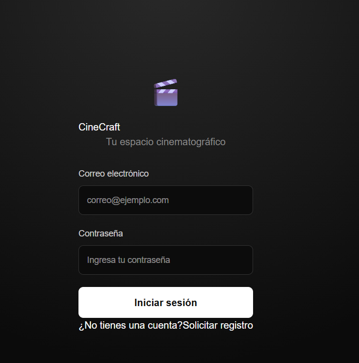
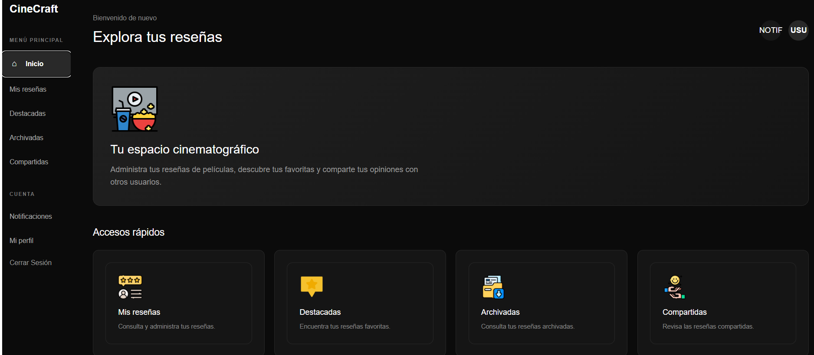
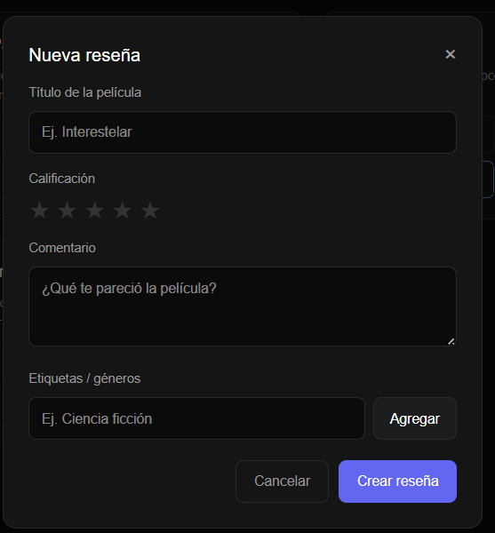
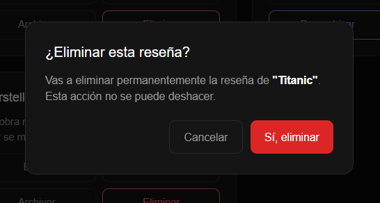
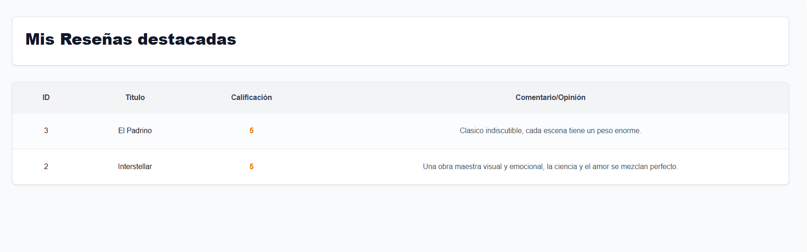
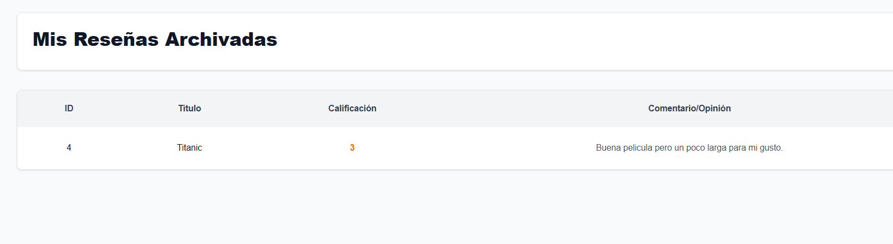
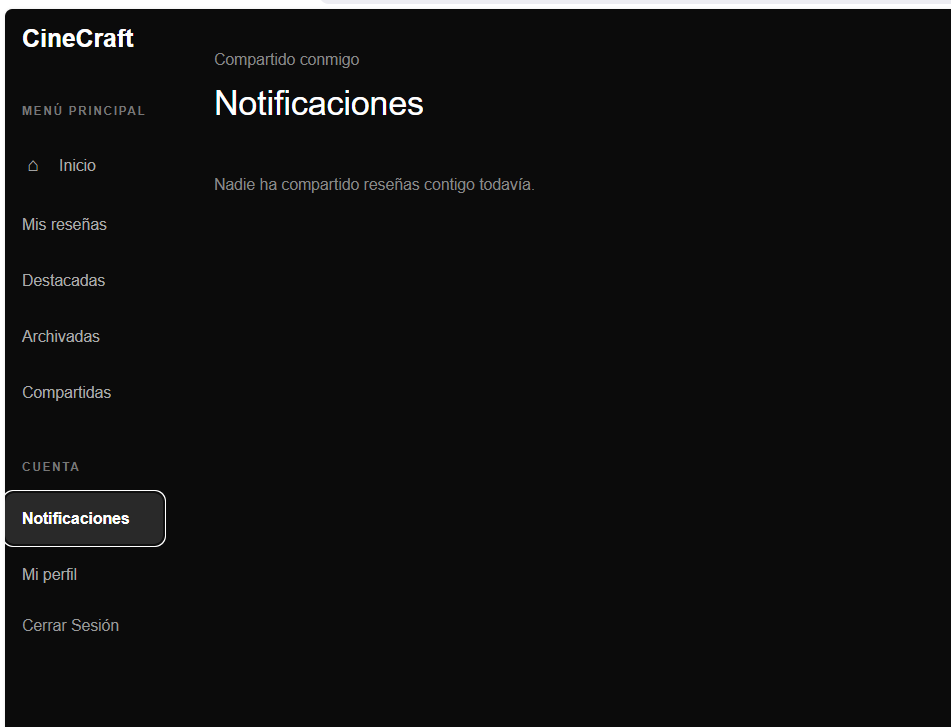
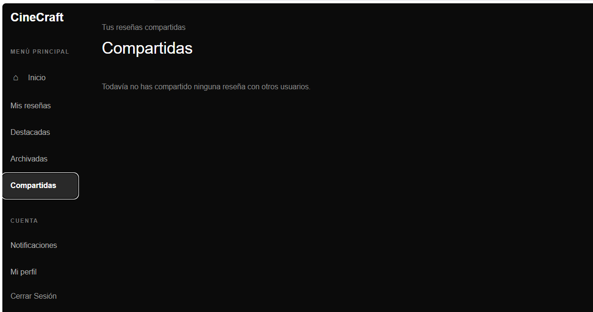

# Manual de Usuario - CineCraft

Universidad de San Carlos de Guatemala
Facultad de Ingeniería - Escuela de Ciencias y Sistemas
Análisis y Diseño de Sistemas 1

## 1. ¿Qué es CineCraft?

CineCraft es una plataforma donde puedes guardar tus opiniones sobre las películas que has visto: le pones un título, una calificación de 1 a 5 estrellas, un comentario y las etiquetas que quieras (género, tema, lo que sea). Desde ahí puedes editarlas, eliminarlas, marcarlas como favoritas, guardarlas en un archivo aparte, o compartirlas con otro usuario de la plataforma.

## 2. Iniciar sesión

Al entrar a la aplicación se muestra la pantalla de inicio de sesión. Hay que ingresar el correo y la contraseña registrados y presionar **Iniciar sesión**.

Si los datos son incorrectos, el sistema muestra un mensaje de error debajo del formulario sin recargar la página. Si el inicio de sesión es correcto, se redirige automáticamente al dashboard principal.

## 3. Dashboard

Es la pantalla principal después de iniciar sesión. Muestra un mensaje de bienvenida y accesos rápidos a las secciones más usadas: Mis reseñas, Destacadas, Archivadas y Compartidas.

En la barra lateral izquierda se puede navegar en cualquier momento entre todas las secciones de la cuenta, y cerrar sesión desde el botón inferior.

## 4. Mis reseñas

Aquí se administran todas las reseñas propias.

### Crear una reseña

Se presiona el botón **+ Nueva reseña**, ubicado en la parte superior derecha. Se abre un formulario donde se pide:

- Título de la película (obligatorio)
- Calificación, seleccionando de 1 a 5 estrellas
- Comentario (obligatorio)
- Etiquetas: se escriben y se agregan una por una con el botón **Agregar** o presionando Enter

Si el título o el comentario quedan vacíos, o no se selecciona ninguna estrella, el sistema muestra un mensaje de validación y no deja guardar hasta corregirlo.

### Editar una reseña

Cada tarjeta de reseña tiene un botón **Editar**, que abre el mismo formulario pero con los datos ya cargados. Se pueden modificar el título, la calificación, el comentario y las etiquetas.

### Eliminar una reseña

El botón **Eliminar** de la tarjeta pide confirmación antes de borrar la reseña de forma definitiva, para evitar eliminaciones por accidente.

### Destacar una reseña

El botón **Destacar** marca la reseña como favorita. Cuando está activa, el botón cambia de color y la reseña también aparece en la sección **Destacadas**. Se puede desmarcar en cualquier momento presionando el mismo botón.

### Archivar una reseña

El botón **Archivar** mueve la reseña a la sección **Archivadas** sin borrarla. Una reseña archivada deja de mostrarse entre las reseñas activas y solo se puede consultar en esa sección, desde donde también se puede desarchivar.

## 5. Destacadas

Muestra únicamente las reseñas que se marcaron como destacadas desde "Mis reseñas", con su título, calificación y comentario.

## 6. Archivadas

Muestra únicamente las reseñas archivadas, siguiendo el mismo formato que la sección de Destacadas.

## 7. Compartir una reseña

Un usuario puede compartir cualquiera de sus reseñas con otro usuario registrado en la plataforma, buscándolo por nombre, apellido o correo. La reseña compartida le aparece al destinatario en su sección de **Notificaciones**, junto con el nombre de quien la compartió.

## 8. Notificaciones

Muestra las reseñas que otros usuarios han compartido con la cuenta actual, indicando quién es el propietario original de cada una.

## 9. Compartidas

Muestra todas las reseñas propias que se han compartido, junto con la lista de personas con las que se compartió cada una. Desde aquí también se puede dejar de compartir una reseña con alguien en específico.

## 10. Cerrar sesión

Desde el botón **Cerrar Sesión** en la parte inferior de la barra lateral se termina la sesión actual y se regresa a la pantalla de login.
